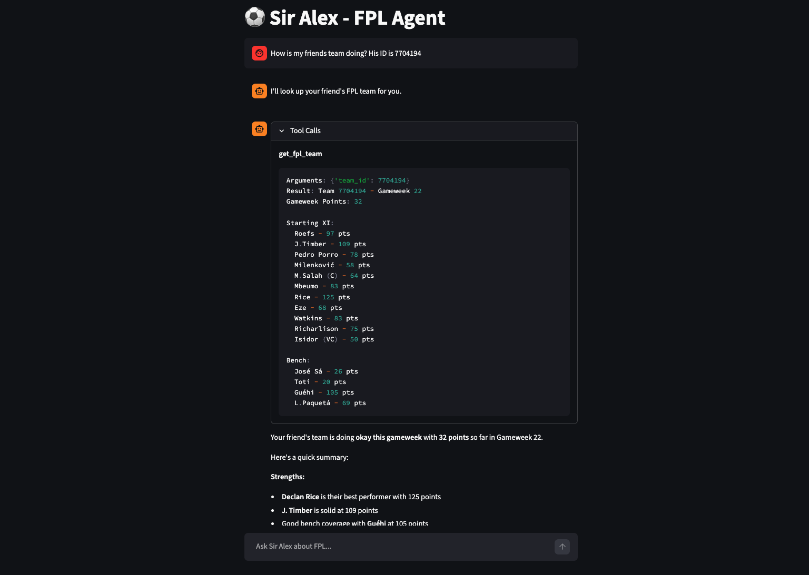
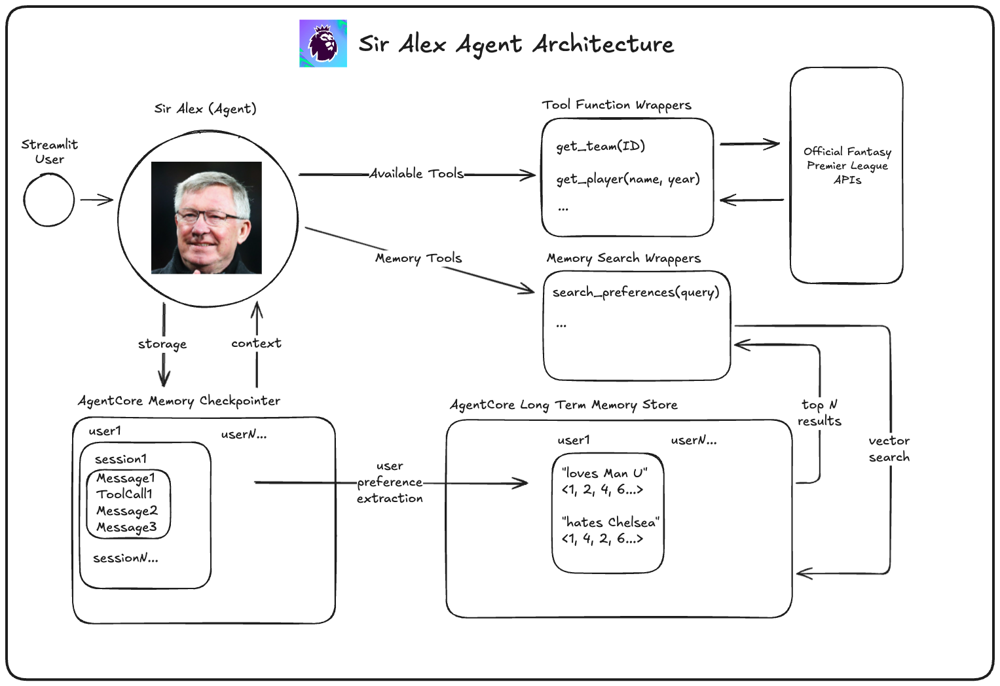

# Sir Alex (FPL Agent) Project



This project is a simple agent for crafting the best Fantasy Premier League team of all time!

## Main Features
Sir Alex has access to three main tools to help you in your quest for a championship:
1. Access to live and current season footballer data, including your current team and scores
2. Access to transfer news, periodically making sure none of your players are at risk of not playing
3. Memory of your preferences, for instance players you would never have on your team

## Architecture Breakdown



Sir Alex was created using:
- Streamlit (UI)
- LangGraph (Agent framework)
- OpenRouter (LLM provider)
- Bedrock AgentCore Memory (Short term memory storage, long term preference extraction)
- Digital Ocean (Infra + hosting)


## How to use Sir Alex
Because this is demo app, proper auth was not implemented. You'll need to enter a valid unique ID to get started.

Reach out to @jgordley for the URL.

## Development

### Setup
```bash
pip install -r requirements.txt
```

### Running the App
```bash
PYTHONPATH=. streamlit run app/main.py
```

### Running Tests

**Unit tests only:**
```bash
pytest tests/unit -v
```

**Integration tests only** (requires `OPENROUTER_API_KEY`):
```bash
pytest tests/integration -v
```

**All tests:**
```bash
pytest -v
```

Integration tests use [AgentEvals](https://github.com/langchain-ai/agentevals) to validate agent trajectory and tool selection accuracy.

## Future Improvements/Discussion

For demo purposes...
- Streamlit was used. In reality, we would need a proper frontend and backend API with something like FastAPI to handle invoking the agent, hosted on something like Fargate or AgentCore Runtime.
- This repo isn't containerized with a proper entrypoint. I used Digital Ocean to host and pull directly from Github on pushes to Main, then build and run with commands I provided.
- I didn't have time to instrument the agent and implement observability/monitoring, happy to talk lots more about this.
- Postgres/DB storage would be great to add to this project. Things like team IDs to users, etc.
- Caching is a great fit for this project as tool calls with similar player queries during the week can all be cached across users.
- Small model usage wasn't tested thoroughly but works for happy cases. Would need to experiment/optimize around cost, accuracy, and latency for the query generation for long term memory and guardrails.
- AgentCore Memory was created manually for one deployment. In the future, this should be created through CDK.
... will keep thinking
